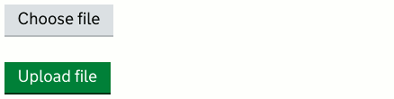
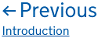

Design components
=================

This lists the design components that were designed specifically for the Money
to Prisoners services, and explains why we created them on top of
`GOV.UK Elements <http://govuk-elements.herokuapp.com/>`_.

Dialogs
-------

Modal dialog
~~~~~~~~~~~~

.. code-block:: html

  

    

      
<strong>Do you want to submit only the selected credits?</strong>

      <button type="submit" class="button" value="override">Yes</button>
      <button type="button" class="button button-secondary js-Dialog-close"
              data-analytics="pageview,/batch/-dialog_close/">
        No, continue processing
      </button>
    

  

The dialog will appear on calling the `Dialog.render` function or by using a
link:

.. code-block:: html

  <a href="#some-dialog" class="js-Dialog">Print</a>

Check boxes
-----------

Purpose: make check boxes more visible than the default IE8 checkbox, and make
the area around them larger than the box itself for easier clicking.

.. image:: static/checkboxes.png
  :align: center

.. code-block:: html

  <td class="check">
    <input type="checkbox" name="credits" id="check-123" class="Checkbox"/>
    <label for="check-123">Credited</label>
  </td>

Form Unload
-----------

Pops up a message if a form is modified and then unloaded (by pressing the back
button or going to another page)

.. image:: static/unload.png
  :align: center

.. code-block:: html

  <form class="js-BeforeUnload" data-unload-msg="Do you want to leave this site?">

Upload
------

Hides the default upload file control and shows something more inline with GOV.UK design

.. code-block:: html

  <label for="id_location_file" id="id_location_file-label" class="upload-choose button button-secondary">
    Choose file
  </label>

Year field completion
---------------------

Turn a 2-digits year into a 4-digit year when focus leaves a field. E.g. 83 -> 1983.

.. code-block:: html

  <input class="mtp-date-input__year-completion …" … type="number" />

Pagination
----------

This pattern differs from the `recommendation for GOV.UK <https://designpatterns.hackpad.com/Pagination-erRdhBW8sAK>`_
as it doesn't flush the page links to the right. This was found to be an accessibility issue for
users with screen magnifiers, who don't scroll horizontally much and often miss
links that are on the right hand side of a page.

.. image:: static/page-list.png
  :align: center

.. code-block:: html

  <ul class="mtp-page-list">
    <li>Page</li>
    <li><a href="..." class="mtp-page-list__current-page">1</a></li>
    <li><a href="...">Page 2</a></li>
  </ul>
  
Page 1 of 2.

Another pagination method is implemented (absent in toolkits provided by GOV.UK) following the style of previous/next
buttons seen in sub-pages of
`Staying in touch with someone in prison <https://www.gov.uk/staying-in-touch-with-someone-in-prison>`_

.. code-block:: html

  <nav class="mtp-pagination" role="navigation" aria-label="Pagination">
    <ul class="group">
      <li class="previous">
        <a title="Navigate to previous page" rel="prev" href="...">
          Previous
          Page title...
        </a>
      </li>
      <li class="next">
        <a title="Navigate to next page" rel="next" href="...">
          Next
          Page title...
        </a>
      </li>
    </ul>
  </nav>

Sticky header
-------------

A yellow bar that appears as the user scrolls down the credits table, in
order to always show the total amount of credits processed.

.. code-block:: html

  

    ...
  

