# Money to Prisoners design components

This lists the design components that were designed specifically for the Money
to Prisoners services, and explains why we created them on top of
[GOV.UK Elements](http://govuk-elements.herokuapp.com/).

## Summary boxes

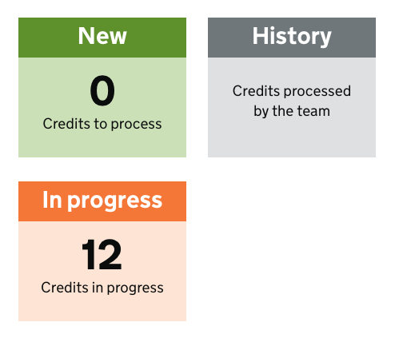

```
  <ul class="SummaryBoxes">
    <li class="SummaryBoxes--variant-1">
      <a href="/batch/">
        <h2>New</h2>
        <p>
          <strong>0</strong> Credits to process
        </p>
      </a>
    </li>

    <li>
      <a href="/history/">
        <h2>History</h2>
        <p>Credits processed by the team</p>
      </a>
    </li>

    <li class="SummaryBoxes--variant-2">
      <a href="/locked/">
        <h2>In progress</h2>
        <p>
          <strong>12</strong> Credits in progress
        </p>
      </a>
    </li>
  </ul>

```


## Collapsing Tables

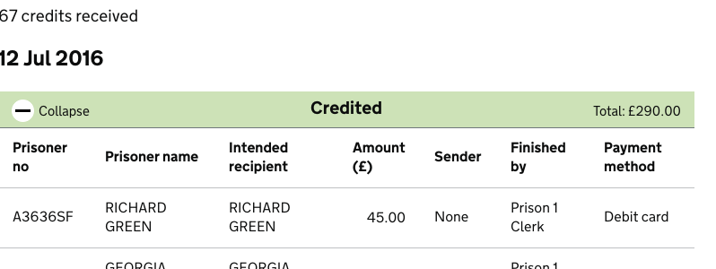

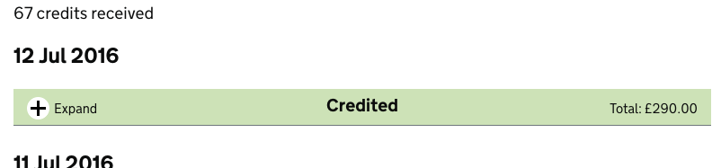

```
<table id="HistoryBatch-2-1" class="CollapsingTable">
  <caption class="CollapsingTableHeader HistoryHeader-uncredited" data-collapse-text="Collapse" data-expand-text="Expand">
    Uncredited
    <span class="CollapsingTableHeader-aside CollapsingTableHeader-aside-right">
      Total: £100.00
    </span>
  </caption>
<thead>...</thead>
<tbody>
...
```

## Dialogs

Modal dialog

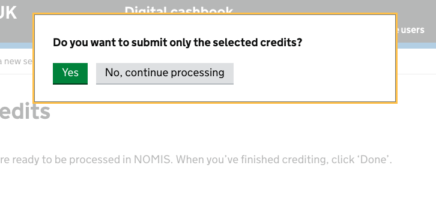

```
<div id="incomplete-batch-dialog" class="Dialog u-nojs-hidden" style="" data-hide-close="true" data-disable-backdrop-close="true" open="open" tabindex="-1" role="dialog">
  <div class="Dialog-inner">
    <p><strong>Do you want to submit only the selected credits?</strong></p>
    <button type="submit" class="button" value="override">Yes</button>
    <button type="button" class="button button-secondary js-Dialog-close"
            data-analytics="pageview,/batch/-dialog_close/">
      No, continue processing
    </button>
  </div>
</div>
```

The dialog will appear on calling the `Dialog.render` function or by using a
link:
```
  <a href="#some-dialog" class="js-Dialog">Print</a>
```

## Help popup

Does what `<details>` does in modern browsers http://govuk-elements.herokuapp.com/typography/#typography-hidden-text
but works in IE8 and also triggers analytics event when used.

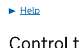

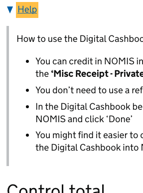

```
<div class="help-box print-hidden help-box-hidden">
  <p>Before text</p>

  <div class="help-box-title"
       aria-controls="help-box-contents" aria-expanded="false" role="heading">
    <div></div><a href="#">Help</a>
  </div>
  <div class="panel panel-border-narrow help-box-contents" id="help-box-contents">
        ...
  </div>
</div>
```

## Checkboxes

Purpose: make check boxes more visible than the default IE8 checkbox, and make
the area around them larger than the box itself for easier clicking.

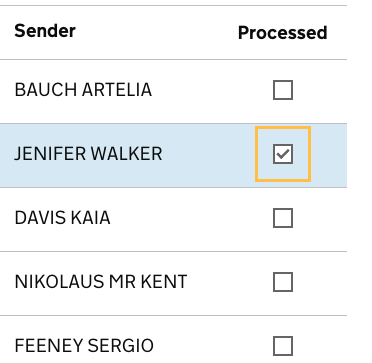

```
<td class="check">
  <input type="checkbox" name="credits" id="check-25828" class="Checkbox"/>
  <label for="check-25828">Credited</label>
</td>
```

## Form Unload

Pops up a message if a form is modified and then unloaded (by pressing the back
button or going to another page)

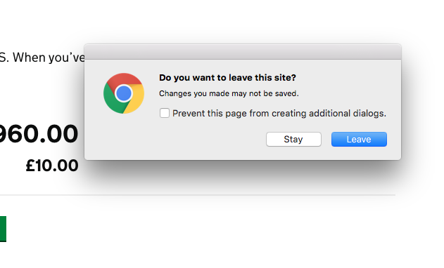


```
<form
    class="js-BeforeUnload"
    data-unload-msg="You are leaving this page, but have ticked credits. &#x0A;&#x0A; Click ‘Done’ if credits have been processed in NOMIS.">
```

## Upload

Hides the default upload file control and shows something more inline with
GOV.UK design


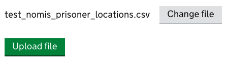


```
<label for="id_location_file" id="id_location_file-label"
       class="upload-choose button button-secondary">
  Choose file
</label>
```


## Year field completion

Turn a 2-digits year into a 4-digit year when focus leaves a field. Eg, 83 ->
1983.

```
<input class="form-control form-year-field" id="id_prisoner_dob_2"
       name="prisoner_dob_2" value="" type="number">
```

## Pagination

This pattern differs from the [recommendation for GOV.UK](https://designpatterns.hackpad.com/Pagination-erRdhBW8sAK) as it doesn't flush
the page links to the right. This was found to be an accessibility issue for
users with screen magnifiers, who don't scroll horizontally much and often miss
links that are on the right hand side of a page.


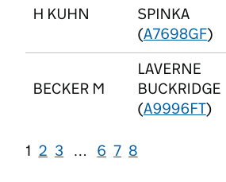

```
<ul class="Pagination print-hidden">
  <li>
    <a href="?page=1" class="Pagination-current-page">
      <span class="screenreader-only">Page </span><span>1</span>
    </a>
  </li>
  <li>
    <a href="?page=2">
      <span class="screenreader-only">Page </span><span>2</span>
    </a>
  </li>
  <li>
    <a href="?page=3">
      <span class="screenreader-only">Page </span><span>3</span>
    </a>
  </li>
  <li>…</li>
```

## Sticky header (cashbook)

A yellow bar that appears as the user scrolls down the credits table, in
order to always show the total amount of credits processed.

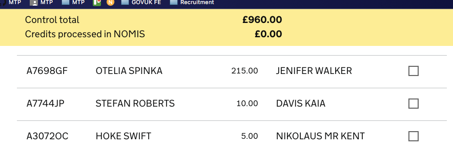

```
<div class="totals js-StickyHeader is-sticky" style="top: 0px;">
  <div class="container js-RunningTotal" data-label="Credits processed in NOMIS">
    <p>
      <span class="label">Control total</span><span class="total">£960.00</span>
    </p>
    <p class="label print-hidden" aria-live="polite" aria-atomic="false"><span
    class="label">Credits processed in NOMIS</span><span class="total
    js-RunningTotal-total">£0.00</span>
    </p>
  </div>
</div>
```
